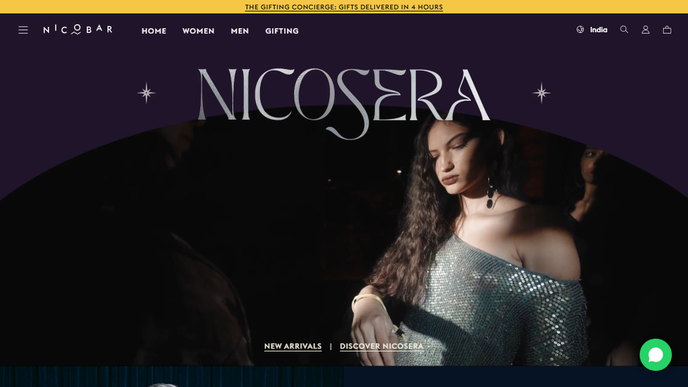

# Raje-Maharaje.shop

> **Bespoke Luxury Menswear, Regal Wedding Favors & Royal Gifting Experience**  
> Rooted in regal Indian heritage and modern craftsmanship, *Raje Maharaje* curates bespoke menswear, handcrafted festive favors, and luxury corporate gifting.

---

## 🏛️ Overview

**Raje-Maharaje.shop** is a luxury digital flagship experience designed to embody the elegance, grandeur, and meticulous craftsmanship of royal Indian couture and bespoke gifting. Every section of the digital storefront is curated with editorial typography, high-definition runway media, tactile textures, and responsive layouts.

---

## ✨ Key Features

- **👑 Editorial Video Hero Campaign**  
  Cinematic high-definition palace runway video hero with custom playback controls, sound toggle, and responsive presentation across desktop and mobile.

- **📜 Dynamic Header & Announcement Bar**  
  Contextual announcement ticker (desktop & mobile tailored) with a floating, transparent-to-solid glassmorphism navigation bar and full-screen mobile drawer menu.

- **👔 Curated Styles & Sartorial Essentials**  
  Rich grid presentation highlighting bespoke bandhgalas, handcrafted suits, royal velvet ensembles, and silk scarves with interactive hover states and direct collection deep-links.

- **🍷 Dual Split Editorial Banners**  
  Distinctive *Royal Red* and *Man of the Hour* dual-column storytelling sections emphasizing artisanal textile craftsmanship and personalized tailoring.

- **🎁 The Gifting Concierge & Bespoke Chests**  
  Dedicated portals showcasing royal gifting boxes, velvet trunks, festive hampers, and corporate wedding favors with direct concierge inquiry channels.

- **✨ The Styling Series**  
  Curated editorial collaboration featuring patron profiles, behind-the-scenes sartorial edits, and high-fashion photography.

- **📰 Press Slider Showcase**  
  Interactive carousel highlighting feature coverage, magazine press releases (Elle, GQ, Vogue, Grazia), and editorial mentions.

- **📻 RJ Core & Radio Corner**  
  Authentic royal heritage branding section linking to bespoke playlists, atelier stories, and community culture.

- **🌿 Scent Experience & Atelier**  
  Sensory olfactory presentation spotlighting artisanal fragrances, packaging details, and bespoke atelier consultations.

- **💬 WhatsApp Concierge & Royal Footer**  
  Floating direct WhatsApp assistance, royal crest motifs, and an exhaustive site directory covering customer service, atelier locations, and social channels.

---

## 🛠️ Tech Stack & Architecture

- **Markup**: Semantic HTML5 with accessible ARIA landmarks and metadata
- **Styling**: Modern CSS3 with CSS Custom Properties, CSS Grid, Flexbox, responsive typography, and smooth micro-interactions
- **Scripting**: Vanilla JavaScript (ES6+) for zero-dependency high performance (drawer toggles, scroll detection, video playback handlers, press slider)
- **Typography**: Custom Euclid Flex, Bodoni Moda, Cinzel, and Playfair Display
- **Media**: Optimized WebP/JPEG imagery, SVG vectors, and H.264 compressed MP4 media

---

## 📂 Project Structure

`
raje-maharaje.shop/
├── index.html              # Main HTML5 digital storefront
├── style.css               # Core styling, responsive typography & animations
├── app.js                  # Frontend interactivity & media management
├── README.md               # Repository documentation
├── .gitignore              # Git ignore rules for clean repository
└── assets/                 # High-resolution media, fonts & SVG assets
    ├── euclidflex_light.woff2
    ├── euclidflex_medium.woff2
    ├── hero_palace.mp4
    ├── generate_with_vedio_by_wearing.mp4
    ├── preview.png
    ├── *.jpg / *.png       # Curated editorial photography
    └── *.svg               # Royal badges, icons, & vector assets
`

---

## 🚀 Getting Started

### 1. Clone the repository
`ash
git clone https://github.com/codewithumesh00-sketch/Raje-Maharaje.shop.git
cd Raje-Maharaje.shop
`

### 2. Run locally
Since this is a lightweight, zero-dependency static web application, you can simply:
- Open index.html directly in any web browser, or
- Use a local development server:

`ash
# Using Python
python -m http.server 8000

# Using Node (npx)
npx serve .
`

Open http://localhost:8000 in your browser to explore the website.

---

## 📱 Responsive Support

Optimized and tested across all major viewport sizes:
- **Mobile Devices**: 360px – 430px (iPhone SE, iPhone 14/15/16 Pro Max, Samsung Galaxy, Pixel)
- **Tablets**: 768px – 1024px (iPad Mini, iPad Air, iPad Pro)
- **Laptops & Desktops**: 1280px – 1920px+ (MacBook Pro, 1080p, 1440p 2K, 4K Displays)

---

## 📄 License & Attribution

All rights reserved © Raje Maharaje. Designed and developed for bespoke luxury heritage experience.
